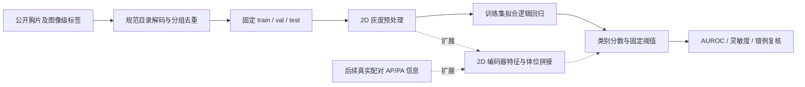

# 医学影像算法与多模态方案设计

## 2. 主任务：胸片影像级异常类别检测

本项目研究小样本胸部 X 光图片的 NORMAL / PNEUMONIA 标签二分类，属于检测方向的影像级分类任务。输入是一张胸片 JPEG，后续可增加与该影像配对的拍摄体位字段。输出是 PNEUMONIA 类别分数和按照固定阈值得到的类别，不输出病灶框或分割掩膜。结果用于比较数据处理和算法方案、筛选成功与失败样本供研发讨论，不用于诊断、治疗或临床决策。

## 3. 数据与辅助信息

### 3.1 数据选择与本地范围

使用公开的 Kermany 儿科胸片数据。常见 Kaggle 版本按 NORMAL/PNEUMONIA 分类提供 JPEG，属于图像级标签，没有本项目可用的框、掩膜或逐例报告。数据卡将人群描述为广州妇女儿童医疗中心的 1–5 岁儿童，不能据此给每张本地图片补填具体年龄或体位。来源、版本差别及 CC BY 4.0 / research only 说明见 [README](README.md)；原作者发布页：[Mendeley v2](https://data.mendeley.com/datasets/rscbjbr9sj/2)、[v3](https://data.mendeley.com/datasets/rscbjbr9sj/3)，胸片说明见 [Kaggle 数据卡](https://www.kaggle.com/datasets/tolgadincer/labeled-chest-xray-images)。

仅扫描 `../chest_xray/train`、`val`、`test` 下的两类直接子目录。明确忽略嵌套的另一份 `../chest_xray/chest_xray`、`__MACOSX` 和隐藏资源文件，避免把同一解压包重复计入。

| 原始分区 | NORMAL | PNEUMONIA | 合计 |
|---|---:|---:|---:|
| train | 1,341 | 3,875 | 5,216 |
| val | 8 | 8 | 16 |
| test | 234 | 390 | 624 |
| 合计 | 1,583 | 4,273 | 5,856 |

公开网页有不同总数描述，**本项目以脚本实际可解码文件数为准**。抽取 400 张：train 240、val 80、test 80，每个分区两类各半，约 6.8% 的原始有效图片。副本保留原尺寸和字节，清单记录源相对路径、类别、宽高、原分区、代理患者组、分组 ID、SHA-256 和像素哈希。

### 3.2 分组划分与去重

1. 将 `person123_bacteria_*.jpeg` 和 `person123_virus_*.jpeg` 归为同一 `person123` 代理组；`IM-0123-*`、`NORMAL2-IM-0123-*` 各保留其命名空间，并把同前缀的多个图片序号归为一组。文件名只用于分组和追溯，绝不作为预测输入；其中 bacteria/virus 直接泄漏标签，不能当辅助模态。
2. 对全量规范目录解码，计算文件 SHA-256 和带原尺寸的灰度像素哈希。用“相同代理组或相同像素”构建连通分组，处理传递关系；同一连通组出现标签冲突则整组排除并记录。
3. 任一组只要含原 test 图片，就归测试候选池，其关联的 train/val 图片不进入开发池，避免原测试病例进入训练。其余原 train+val 合并后再划分，以免只用原本 16 张的验证集。
4. 固定种子 20260907，用哈希排序抽样；每组最多保留一张。每类从开发池选 120 张 train 和随后 40 张 val，从原测试候选池选 40 张 test。划分在任何模型训练前固定。
5. 检查三分区间代理组、连通组、文件哈希、像素哈希的交集均为零，复制后再校验哈希。增强数据若以后加入，也只能在划分后的训练集内部生成。

这是**基于文件名的患者/检查分组近似**，不能把无交集等同于真实患者无交集。当前无正式患者—检查映射，也无法证明不同命名空间没有同一人。正式研究应从数据发布者或合规数据管理员获得匿名 patient_id、study_id 映射，按 patient_id 分组，并确保同次检查所有视图和衍生图片跟随；若拿不到，继续把当前实验限定为工程演示，不报告患者级临床性能。

### 3.3 影像之外的一种辅助信息

选择结构化**拍摄体位 `view_position`（AP / PA / UNKNOWN）**。它有助于区分投照方式造成的外观差异，支持分层误差分析；“是否能提高分类”是待验证假设，体位本身不代表疾病。

本地没有逐张可靠体位记录，清单实际填 `UNKNOWN`、`view_position_missing=1`、`metadata_source=not_provided_in_local_release`。不根据图像或数据集总体介绍猜填 AP/PA，不构造假报告，也不使用类别词作为文本特征。

真实项目由数据管理员从原始检查结构化信息中提供体位（例如 DICOM ViewPosition）；在受控环境内通过匿名图像标识与检查标识精确配对后，仅导出 `image_id, patient_id, study_id, view_position` 等白名单字段。多图检查必须按图像标识配对，不能只按文件排序连接；遇到一对多冲突、缺失或时间不对应就保留 UNKNOWN 并送回数据质检。可识别信息不进入模型输入或本项目目录。

## 4. 模型思路与辅助信息参与方式

### 4.1 先做容易理解的 2D 基线

选择 **2D 灰度像素 + L2 正则化逻辑回归**。每张 JPEG 本来就是二维投影，既无 CT 切片序列，也无可用三维体数据，因此 2.5D/3D 会凭空引入不存在的上下文。逻辑回归只有线性权重与偏置，在 CPU 上能完成训练，适合先确认标签、划分、预处理和指标是否连通。

实际执行的步骤：

1. 完整解码图片，转换为灰度，等比例缩放并居中补黑到 16×16；不裁切肺部，不翻转，不做增强。保存的 400 张副本仍是原图，16×16 仅为此极简基线的临时输入。
2. 像素除以 255 后展平成 256 维。逐维均值和标准差仅从 train 计算，标准差下限 `1e-6`；val/test 使用同一组统计量。
3. 以 PNEUMONIA=1、NORMAL=0，训练加权二元交叉熵加 `λ/2 × ||w||²` 的逻辑回归，λ=0.01；偏置不正则化，权重从零开始，全批梯度下降 1,500 步。学习率由训练特征的 Hessian 上界确定，记录损失以检查数值行为。
4. 输出 `sigmoid(w·x+b)` 分数，预先固定阈值 0.5 得到类别。分数未做概率校准，不可解释为个人患病概率。参数均在查看测试表现前固定，val 只用于本轮合理性检查。

类别不平衡处理采用训练集频数的逆频率权重 `n / (2*n_class)`，只在训练计算；此平衡子集的两类权重恰好都是 1。正式扩展时优先保留验证/测试集的自然分布。小病灶不是本任务的标注单位，不能报告小目标召回；16×16 会丢失局部细节，这本身是需要讨论的基线缺陷。

### 4.2 改进方向：带体位信息的 2D 表征

后续设想用 224×224 的 2D 编码器（如 ResNet-18）提取图像特征，先冻结编码器训练分类头，再决定是否微调。该部分**没有实现或训练**，还需单独核对所选预训练权重的来源和使用条款。保留相同划分，先比较它与低分辨率逻辑回归，检验更丰富图像表征的作用。

在获得真实配对体位数据后，将 `one_hot(AP, PA, UNKNOWN)` 和缺失指示与图像特征拼接，经过小分类头输出分数；训练时随机把一部分可用体位置为 UNKNOWN，学习缺失时的退化路径。现阶段运行的基线只读取像素，辅助信息全部缺失时直接继续图像分类，并在报告中披露缺失率。

要识别多模态收益，比较“同一编码器、只用图像”与“同一编码器、图像+体位”，其他配置、划分和训练预算一致；分别查看体位可用、缺失、AP、PA 子集。体位随机打乱作为捷径检查，只在开发集进行。当前全缺失数据无法进行此消融，也不能声称多模态更好。

## 5. 怎样验证与处理风险

### 5.1 两个指标

- **AUROC**：测量 PNEUMONIA 样本分数排在 NORMAL 之上的能力，减少对单一阈值的依赖。代码使用正负样本两两比较的定义，相等记 0.5；缺少任一类则停止计算。
- **灵敏度**：`TP / (TP+FN)`，反映固定阈值下数据集阳性标签的检出比例。始终同时附 TP/FN/FP/TN 原始计数，避免全判阳性得到高灵敏度而误导；计数用于解释指标，不另列更多优化目标。

不采用 Dice，因为没有掩膜。每个测试类别只有 40 张，一个阳性样本即可让灵敏度变动 2.5 个百分点，所以只做工程量级描述，不作临床推断；正式研究应扩大独立测试集并按真实患者分组自助采样估计置信区间。均衡抽样不代表真实阳性比例，尤其不能推导部署时的阳性预测值。

### 5.2 最小验证流程与交付验收

1. **先检查可读性**：只扫描规范目录，统计 5,856 张；逐张完整解码、尺寸检查与哈希；错误或未知分组命名写入 `read_errors.json` 并停止。检查 `source_inventory.csv` 中的异常尺寸和重复组，必要时人工审查。
2. **检查划分**：确定 240/80/80、两类齐全，代理组与哈希跨集交集为零，复制字节一致；注意这是必要的工程检查，无法补足真实身份验证。
3. **运行基线**：只用 train 拟合模型及标准化参数，检查训练损失和 val 结果。冻结设置后评估 test，保存环境、配置、清单哈希、模型参数和全部预测。
4. **查看成功与失败**：用预定义的样本 ID 排序，在 test 中各展示最多 4 个 TP/TN/FP/FN，避免只挑好看的图片；对照 `predictions.csv` 查看原图、标签和分数。复核重点是缩放、边缘文字、图像质量及错误模式，不凭观察修改测试标签。实际检查记录在 `reports/RESULTS.md`。
5. **检查关键代码行为**：测试患者多图归组、像素重复传递、跨集哈希泄漏拒绝、AUROC 并列分数、人工构造可分数据的优化行为。通过意味着核心工程约束成立，不意味着医学有效。

当前 test 已用于结果展示和错例分析，因此后续如果据此修改模型，需要额外保留一份未查看的测试集；不能在这 80 张上反复优化后仍称其为独立最终评估。

### 5.3 可能失败的情况

| 失败情况 | 如何发现 | 后续处理 |
|---|---|---|
| 缩小后局部信息消失，或原图曝光/运动质量差 | 对照原图与低分辨率输入，复核假阴性及质量分层计数 | 保留原图，下一轮用更高分辨率 2D 表征；预定义质量标记，不按预测对错删样本 |
| 模型学习边缘文字、黑边或尺寸差异 | 复核误判图；在开发集做固定边缘遮挡/尺寸分层敏感性分析 | 统一处理规则，加入质量审核；不把热图等同于病灶定位 |
| 成人、其他医院或设备的分布不同 | 按来源/设备/年龄（若有真实信息）分层，在外部去标识化数据上独立测量 | 明确缩小适用范围，补充合规外部数据；不能将本数据结果外推 |
| 原标签有误或视觉含义含糊 | 冲突标签重复组检查；把高分错例交给有资质标注人员复核 | 保存原标签、争议状态和复核版本；重新设计评估，禁止模型预测自动纠正标签 |
| 真实同患者跨不同命名空间，或裁剪重编码近重复 | 获得正式匿名身份映射；进一步用感知相似性筛查并人工核实 | 整患者/检查归组后重划分，必要时废弃受污染评估；当前仅承认代理隔离 |
| 体位缺失、配对错误，或体位与类别形成捷径 | 缺失率、图像/检查连接唯一性校验、开发集体位打乱试验 | UNKNOWN 与缺失标记，回退图像模型；修复配对后再做消融 |
| 公开数据来源无法核实或发现识别性文字 | 核对下载记录和官方说明，逐张复核拟外发图片 | 暂停该样本外发/使用，核实来源或改从原始发布渠道取得；不尝试识别人 |

本项目所有分数、标签和错误分析均为数据集层面的研发验证。AI 辅助及可靠性核查方式见 README。
